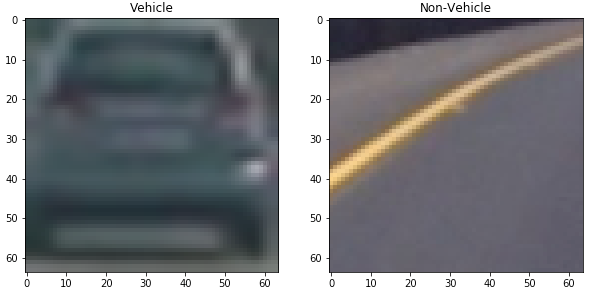
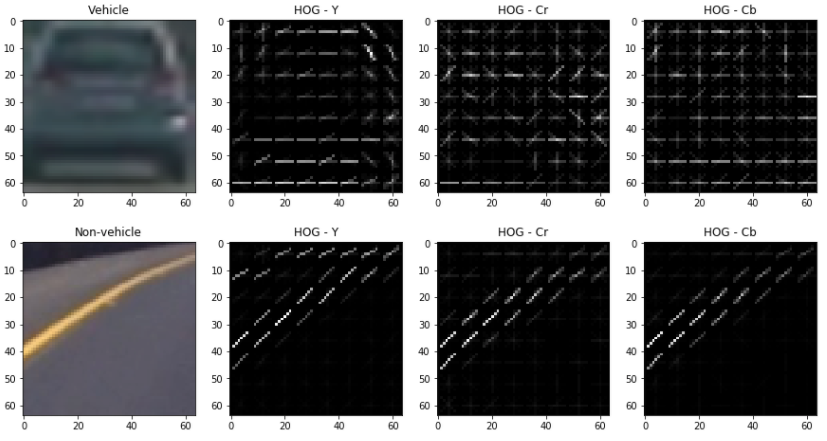
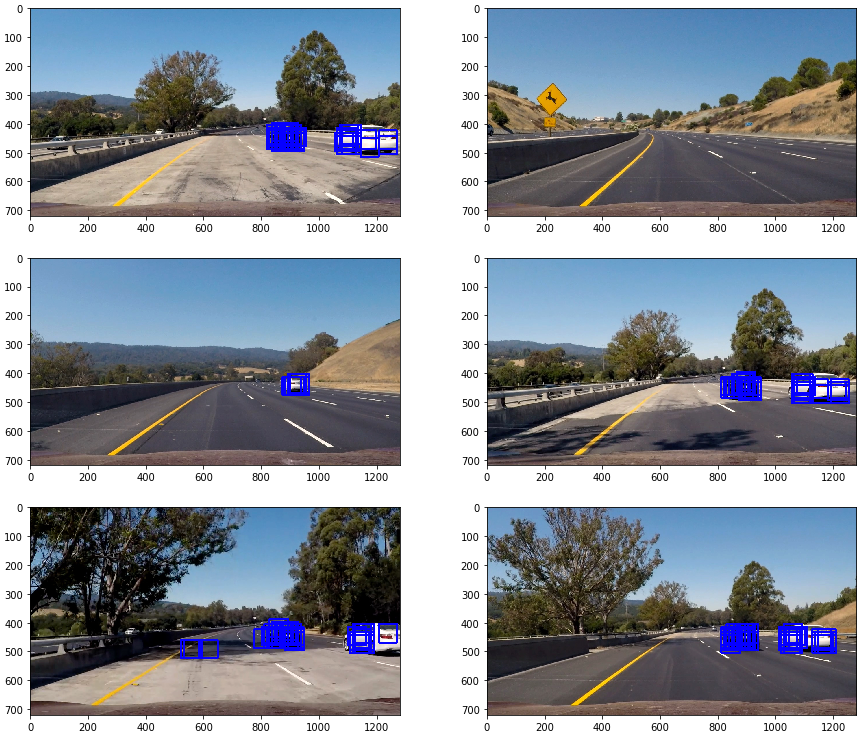
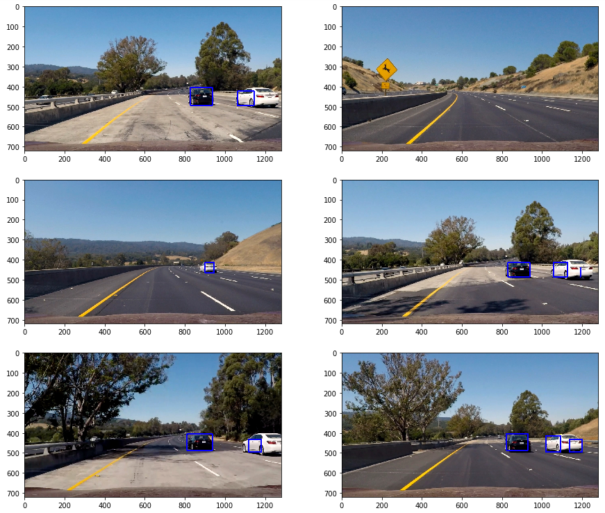
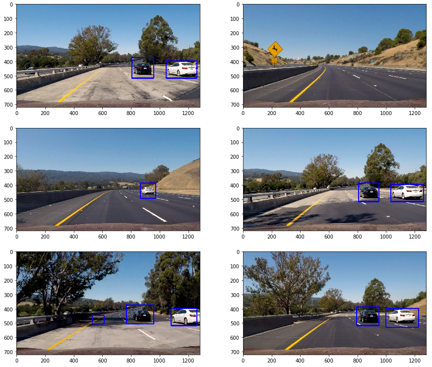

# CarND-Vehicle-Detection-P5
Udacity Self Driving Car Nanodegree - Vehicle Detection

# Prerequisites

To run this project, you need [Miniconda](https://conda.io/miniconda.html) installed(please visit [this link](https://conda.io/docs/install/quick.html) for quick installation instructions.)

# Installation
To create an environment for this project use the following command:

```
conda env create -f environment.yml
```

After the environment is created, it needs to be activated with the command:

```
source activate carnd-term1
```

# Project

## Goals

The goals/steps of this project are the following:

- Perform a Histogram of Oriented Gradients (HOG) feature extraction on a labeled training set of images and train a classifier Linear SVM classifier
Optionally, you can also apply a color transform and append binned color features, as well as histograms of color, to your HOG feature vector.
Note: for those first two steps don't forget to normalize your features and randomize a selection for training and testing.
- Implement a sliding-window technique and use your trained classifier to search for vehicles in images.
- Run your pipeline on a video stream (start with the test_video.mp4 and later implement on full project_video.mp4) and create a heat map of recurring detections frame by frame to reject outliers and follow detected vehicles.
- Estimate a bounding box for vehicles detected.

## [Rubric](https://review.udacity.com/#!/rubrics/513/view) points

Here I will consider the rubric points individually and describe how I addressed each point in my implementation.

### Writeup / README

#### 1. Provide a Writeup / README that includes all the rubric points and how you addressed each one. You can submit your writeup as markdown or pdf. [Here](https://github.com/udacity/CarND-Vehicle-Detection/blob/master/writeup_template.md) is a template writeup for this project you can use as a guide and a starting point.

You're reading it!
The project code could be found on the [Vehicle Detection notebook](Vehicle%20Detection.ipynb).

### Histogram of Oriented Gradients (HOG)

#### 1. Explain how (and identify where in your code) you extracted HOG features from the training images.

The training images are loaded at `In [2]`:

- Vehicle train images count: 8792
- Non-vehicle train image count: 8968

Here is an example of those images:



The feature extraction code (spatial, color and HOG) is at `In [4]`. This cell contains a set of functions provided by Udacity's lectures to extract the features from an image. The function `extract_features` combine the other function and use the class `FeatureParameters` to hold all the parameters in a single place.

Next image shows an example for HOG for a vehicle and non-vehicle calculated at `In [19]`:



#### 2. Explain how you settled on your final choice of HOG parameters.

The parameters were found by manually changing them and experimenting to try to maximize the model accuracy and minimize the fitting time. The final parameters are the following:

|Parameter|Value|
|:--------|----:|
|Color Space|YCrCb|
|HOG Orient|8|
|HOG Pixels per cell|8|
|HOG Cell per block|2|
|HOG Channels|All|
|Spatial bin size| (16,16)|
|Histogram bins|32|
|Histogram range|(0,256)|
|Classifier|LinearSVC|
|Scaler|StandardScaler|

With this parameters, the classifier accuracy was 99.41 % and it took 2.97 seconds to train.

### Sliding Window Search

#### 1. Describe how (and identify where in your code) you implemented a sliding window search. How did you decide what scales to search and how much to overlap windows?

My first approach to implement sliding windows was to calculate all the windows and then apply the feature extraction to each one of them to find the one containing a car. It is implemented on `In [8]`. Cells `In [9]` and `In [10]` contains the code for loading the test images, applying the classifier to the images and drawing boxes. The scales and overlap parameter where found by experimenting on them until a successful result was found. The following image shows the results of this experimentation on the test images:



To combine the boxes found there and eliminate some false positives, a heat map as implemented with a threshold and the function `label()` from `scipy.ndimage.measurements` was used to find where the cars we. The code for this implementation could be found on `In [13]`, and the next image shows the results on the test images:



#### 2. Show some examples of test images to demonstrate how your pipeline is working. What did you do to optimize the performance of your classifier?

The performance of the method calculating HOG on each particular window was slow. To improve the processing performance, a HOG sub-sampling was implemented as suggested on Udacity's lectures. The implementation of this method could be found on `In [14]`. The following image shows the results applied to the test images (the same heatmap and threshold procedure was applied as well on `In [15]`):



### Video implementation

#### 1. Provide a link to your final video output. Your pipeline should perform reasonably well on the entire project video (somewhat wobbly or unstable bounding boxes are ok as long as you are identifying the vehicles most of the time with minimal false positives.)

The video output could be found [project_video.mp4](video_output/project_video.mp4)

#### 2. Describe how (and identify where in your code) you implemented some filter for false positives and some method for combining overlapping bounding boxes.

Some effort was done already to minimize false positives using a heatmap and threshold in the pipeline, but it was not enough. The overlapping bounding boxes were resolved by using the function `label()` from `scipy.ndimage.measurements` to find the cars. To filter false positives, the image heatmap map was averaged over three consecutive frames. The implementation could be found on `In [25]`

### Discussion

#### 1. Briefly discuss any problems / issues you faced in your implementation of this project. Where will your pipeline likely fail? What could you do to make it more robust?

- Use a decision tree to analyze the redundancy on the feature vector and try to decrease its length eliminating redundancy.

- The performance of the pipeline could be improved by trying to decrease the amount of space to search for windows.

- More than one scale could be used to find the windows and apply them on the heatmap.

- The windows size could change for different X and Y values to minimize the number of windows to process.
